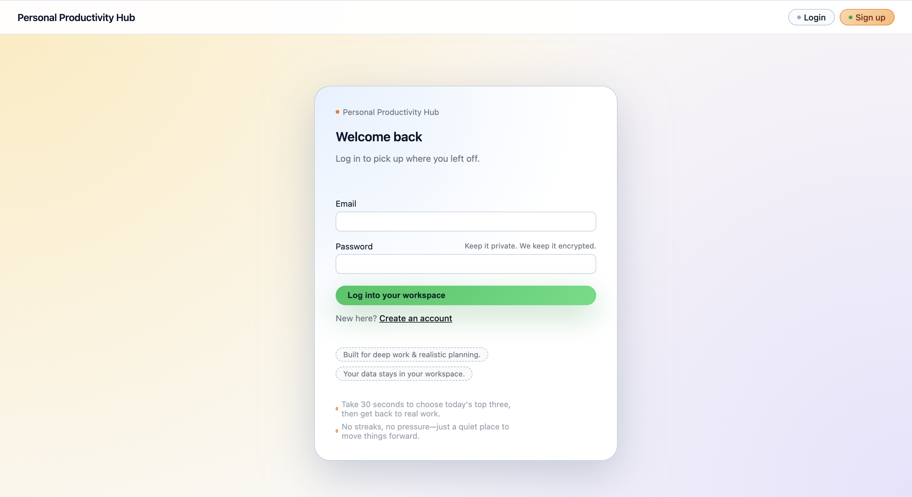
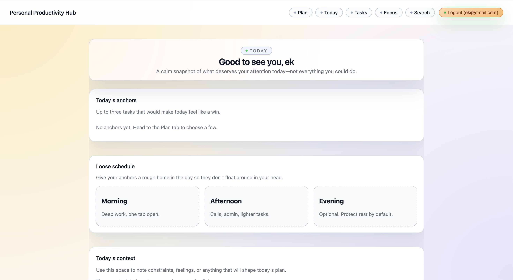
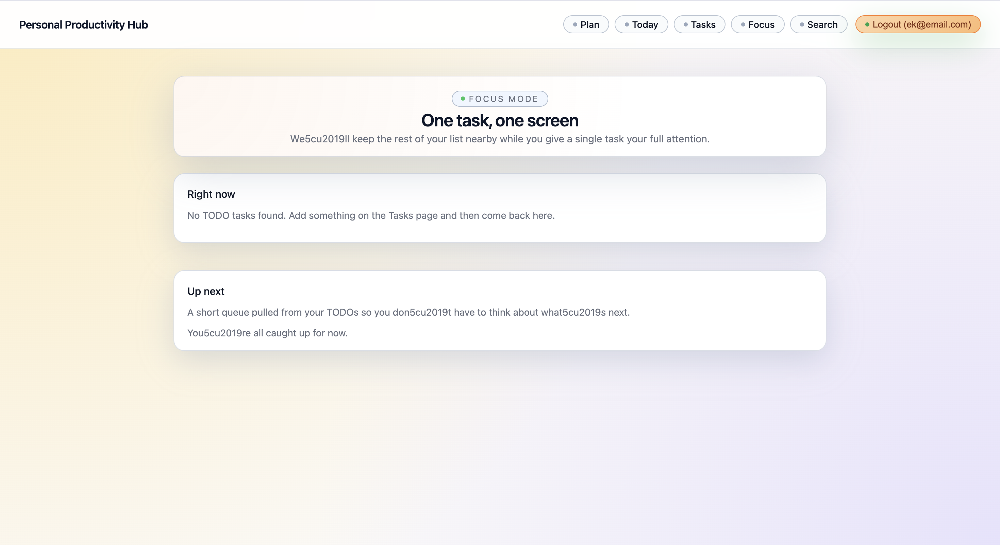
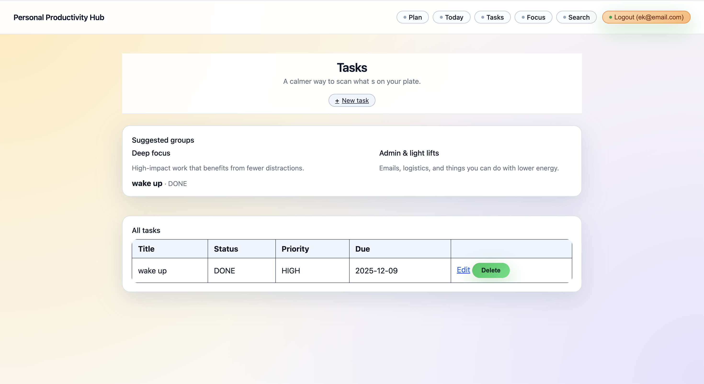

# Personal Productivity Hub

A monolithic productivity web application that brings together **tasks**, **notes**, **bookmarks**, and **calendar-style events** in a single place. It is designed as a clean, modular monolith that showcases solid CRUD patterns, REST-style API design, and basic authentication.

The current UI is themed as an ADHD-friendly daily operating system, with a strong focus on **guided daily planning**, **anchor tasks**, and **focus sessions**, while still being a good reference for a first full-stack Node.js/TypeScript application.

---

## Features

- **User authentication**
  - Email + password signup and login
  - Passwords hashed with bcrypt
  - Session-based authentication with http-only cookies

- **ADHD-friendly daily workflow**
  - **Plan** page (`/plan`) for a guided, three-step daily planning ritual
    - Triage TODOs into "Today" vs "Later"
    - Choose up to three **anchor** tasks for the day
    - Roughly place anchors into Morning / Afternoon / Evening
  - **Today** dashboard (`/`) that surfaces anchors, a loose schedule, and a short "today's context" checklist
  - **Focus** page (`/focus`) that shows one task at a time with a small "up next" queue

- **Tasks (core vertical slice)**
  - Create, edit, list, and delete tasks
  - Status: `TODO`, `IN_PROGRESS`, `DONE`
  - Priority: `LOW`, `MEDIUM`, `HIGH`
  - Optional due dates
  - All data scoped per user
  - Dashboard and tasks list derive "anchors" and lightweight groupings (e.g. "Deep focus" vs "Admin & light lifts") from existing task data

- **Global search**
  - Search across tasks, notes, bookmarks, and events
  - Case-insensitive text search on titles and descriptions
  - Filter by entity type (tasks / notes / bookmarks / events)

- **Opinionated data model**
  - Schema includes labels and join tables for tagging tasks, notes, bookmarks, and events
  - Self-referential `TaskDependency` relation to model dependencies between tasks
  - Notes, bookmarks, and events are modeled in the database and ready to be exposed via routes and UI

---

## Tech Stack

- **Backend:** Node.js, TypeScript, Express
- **Views:** EJS + `express-ejs-layouts` for server-side rendered pages
- **Database:** SQLite with Prisma ORM
- **Auth:** Session-based auth (`express-session`), bcrypt password hashing

This setup keeps the project easy to run locally (single process, single SQLite file) while still reflecting patterns you would use with a larger relational database.

---

## Architecture Overview

The app is structured as a **modular monolith**:

- `src/app.ts` – Express app setup, middleware, view engine, and layout configuration
- `src/server.ts` – HTTP server bootstrap
- `src/config/env.ts` – environment variable loading and configuration
- `src/db/client.ts` – Prisma client singleton
- `src/middleware/auth.ts` – attaches `currentUser` to the request and exposes `requireAuth` guard
- `src/routes/index.ts` – top-level router that wires module routers and top-level pages (dashboard, plan, focus)
- `src/modules/auth` – signup, login, logout routes and controllers
- `src/modules/tasks` – tasks CRUD routes and views
- `src/modules/search` – global search endpoint and view
- `src/views` – EJS templates, including shared `layout.ejs`, dashboard, auth, tasks, search, **plan**, and **focus** views
- `prisma/schema.prisma` – full relational schema for users, tasks, labels, notes, bookmarks, events, and task dependencies

This organization keeps each concern (auth, tasks, search, etc.) in its own module while remaining within a single deployable service.

---

## Getting Started

### Prerequisites

- Node.js (recommended: LTS or current version)
- npm (comes with Node)

### Installation & Setup

Clone the repository and install dependencies:

```bash
cd personal-productivity-hub
npm install
```

Run database migrations and generate the Prisma client:

```bash
npx prisma migrate dev --name init
```

Start the development server:

```bash
npm run dev
```

The app will be available at:

```text
http://localhost:3000
```

If needed, you can customize environment variables via a `.env` file:

```bash
DATABASE_URL="file:./dev.db"
SESSION_SECRET="your-session-secret"
COOKIE_SECRET="your-cookie-secret"
```

---

## UI tour (screenshots)

> Place PNGs at the paths below and they will render directly in this README.

### Login (before authentication)

Public login page shown before you sign in: a clean, centered card with subtle branding and short helper notes.



### Home / Today dashboard (after login)

The default page after logging in at `/`: shows today’s anchors at the top, a loose schedule strip, and a short checklist for today’s context.



### Focus (`/focus`)

Single-task focus view with an "up next" queue.



### Tasks (`/tasks`)

Grouped "Deep focus" and "Admin & light lifts" sections above a full table of tasks.



---

## Usage

### Authentication

1. Go to `http://localhost:3000/auth/signup`.
2. Register with an email and password.
3. After signup, you are redirected to the dashboard.
4. Subsequent logins happen via `http://localhost:3000/auth/login`.

### Daily workflow

- **Plan your day**
  - Navigate to `/plan`.
  - Use the three-step flow to triage TODOs, pick anchors, and loosely place them into the day.
- **Today dashboard**
  - The root route `/` shows today’s anchors, a loose schedule, and a short checklist for today’s context.
- **Focus mode**
  - Navigate to `/focus` to work on a single task at a time with a small up-next list.

None of this currently adds new fields to the database; anchors and groupings are derived from your existing tasks (status, priority, and creation order).

### Tasks

- View all tasks: `GET /tasks`
- Create a task: `GET /tasks/new` (form) → `POST /tasks`
- Edit a task: `GET /tasks/:id/edit` → `POST /tasks/:id`
- Delete a task: `POST /tasks/:id/delete`

All of these routes are protected and require an authenticated session.

### Global Search

- Navigate to `http://localhost:3000/search`.
- Enter a query and optionally choose a type (all / tasks / notes / bookmarks / events).
- Results are grouped by entity kind and limited to the current user.

---

## Project Structure (High Level)

```text
personal-productivity-hub/
├─ prisma/
│  └─ schema.prisma        # Database schema (users, tasks, notes, bookmarks, events, labels, dependencies)
├─ src/
│  ├─ server.ts            # App entrypoint
│  ├─ app.ts               # Express app configuration
│  ├─ config/
│  │  └─ env.ts            # Environment variable loading
│  ├─ db/
│  │  └─ client.ts         # Prisma client instance
│  ├─ middleware/
│  │  └─ auth.ts           # Auth middleware & guards
│  ├─ modules/
│  │  ├─ auth/             # Auth routes
│  │  ├─ tasks/            # Tasks CRUD routes
│  │  └─ search/           # Global search routes
│  └─ views/               # EJS templates (layout, dashboard, auth, tasks, search, plan, focus)
└─ README.md
```

---

## Development

Useful npm scripts:

- `npm run dev` – Start the dev server with live reload
- `npm run build` – Compile TypeScript to `dist/`
- `npm start` – Run the compiled server from `dist/`
- `npm run prisma:migrate` – Run Prisma migrations in dev
- `npm run prisma:generate` – Regenerate the Prisma client

You can inspect the database with the Prisma studio UI:

```bash
npx prisma studio
```

---

## Roadmap / Ideas

- Expose full CRUD flows for **notes**, **bookmarks**, and **events** in the UI
- Persist daily planning data explicitly (e.g. `isToday`, `anchorRank`, `energy`, `estimatedMinutes` on tasks)
- Implement label management and label-based filtering across entities
- Visual calendar view for events
- API-specific routes (pure JSON) for use by a separate frontend or mobile client
- Basic test suite for auth, tasks, and daily planning flows using a Node.js testing framework

This project is a solid foundation for experimenting with full-stack TypeScript, relational data modeling, modular monolith design, and ADHD-aware productivity workflows.
